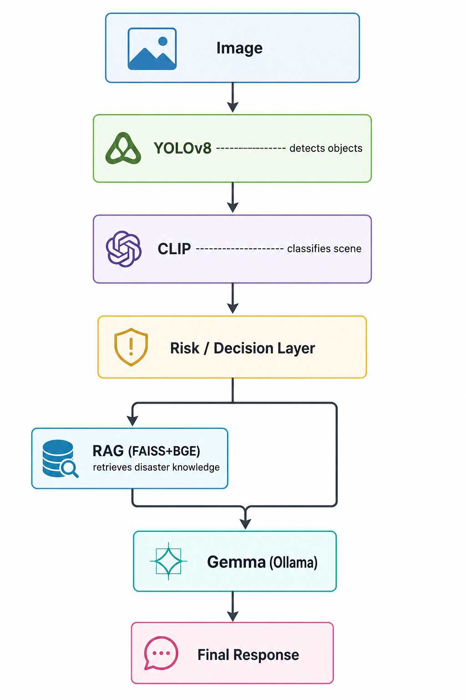

# Rescue AI (Gemma 4 Hackathon)

**Multimodal Retrieval-Augmented Generation System for Emergency Intelligence**

Rescue AI is a production-grade, multimodal disaster response platform designed for real-time triage, situational awareness, and actionable guidance. Built with a modular microservice architecture, it leverages state-of-the-art open AI models for computer vision, Large Language Models(LLMs), and Retrieval-Augmented Generation (RAG).

<p align="center">
  
</p>

## Architecture Overview
- **Frontend:** React + TypeScript for a responsive, real-time user interface.
- **Backend:** FastAPI orchestrates multimodal ML inference, RAG, and LLM agents.
- **Vision:** YOLOv8n (parallelized) for object/person detection; CLIP for scene classification.
- **RAG:** FAISS vector search with semantic reranking, disaster-type metadata, and persistent caching for instant retrieval.
- **LLM:**: Gemma 2B running locally via Ollama for fully offline inference with structured, empathetic, and deterministic triage advice.
- **Telemetry:** All inferences and responses are logged for audit and improvement.

## Key Features

- **Real-Time Multimodal Triage:** Upload images and receive instant, context-aware disaster analysis and first aid actions.

- **Vision Pipeline:**
  - YOLOv8n detects people/objects; CLIP classifies scene (fire, flood, earthquake, etc.).

- **RAG Pipeline:**
  - Ingests real disaster documents.
  - Chunks, filters, and tags context with disaster metadata.
  - Reranks for semantic relevance.

- **Severity Intelligence:** Automated severity scoring based on scene, object/person count, and model confidence.

- **LLM Integration:**
  - Gemma 2b via Ollama, with fallback triage 
  - Prompts enforce: Explanation, Disaster, Actions, for deterministic UI mapping.

- **Telemetry:**
  - All inferences logged for traceability


## Tech Stack

- Frontend: React, TypeScript
- Backend: FastAPI, Python
- Vision: YOLOv8n, OpenAI CLIP
- NLP: Gemma 2B (Ollama), Sentence Transformers (BAAI/bge-small-en-v1.5)
- Retrieval: FAISS

## Quickstart

### Frontend
```bash
cd frontend
npm install
npm run dev
```

### Backend
```bash
cd backend
python -m venv venv
# Windows
.\venv\Scripts\activate
# Mac/Linux
source venv/bin/activate
pip install -r requirements.txt
python main.py
```

### Knowledge Base Setup

The RAG pipeline uses disaster-response documents that are indexed into a FAISS vector database.

1. Place the disaster-response PDF documents inside:

```text
backend/data/
```

2. Generate text files from the PDFs:

```bash
python ingest_pdfs.py
```

3. Start the backend. On the first launch, the application automatically creates the FAISS index and document embeddings.

After indexing, the vector store contains semantic chunks that are used to ground Gemma's responses.